# Modern Prompting & Context Engineering Framework

## System Overview

This skill is a **reasoning strategy selection toolkit**. It provides a catalog of prompting frameworks, each optimized for different task profiles. When invoked, your job is to:

1. Analyze the current task's characteristics (complexity, structure, domain, constraints)
2. Rate every framework below on a 0–100% suitability scale for this specific task
3. Select and apply the highest-rated framework(s) to structure your reasoning

Do not treat these as reference material. Treat them as your **available reasoning engines** — pick the best one for the job.

## Compression Principles

- Conciseness is clarity
- Select essential techniques only
- Multiple strategies available for selection

## Core Cognitive Framework

### OOReDAct

**Purpose:** Deep deliberation before action/decision

Required structure:

```markdown
<observe>
Synthesize [[facts]] and [[observations]]
</observe>

<orient>
understand [[knowledge]] and [[context]]
</orient>

<reason strategy="[[Strategy Name]]" rating="[[0-100%]]">
[[Strategy-specific reasoning - see strategies below]]
</reason>

<decide>
State next [[action]] or final [[response]]
</decide>

<act-plan>
Plan next [[action]] or final [[response]] steps
</act-plan>
```

## Strategy Selection Protocol

**When this skill is invoked, N L M MUST rate every reasoning strategy below on a 0–100% suitability scale for the current task.** This is not optional — it is the core function of this skill. The rating reflects how well each framework fits the task's profile.

### Rating Criteria

Consider these dimensions when scoring each strategy:

| Dimension | What to assess |
|-----------|---------------|
| Task complexity | Is the problem multi-step, branching, or linear? |
| Domain fit | Does the strategy's strengths align with the task domain? |
| Cost tolerance | Can the task afford multiple inference passes or code execution? |
| Accuracy needs | Is a single reasoning path sufficient, or is self-verification needed? |
| Context constraints | How much working memory / context window is available? |

### Rating Output Format

After analysis, N L M MUST produce a ranked table:

```
Strategy Suitability Ratings for: [task summary]

CoT  (Chain-of-Thought) ......... XX%
CoD  (Chain-of-Draft) ........... XX%
ReAct (Cache-Augmented + ReAct) . XX%
SC   (Self-Consistency) ......... XX%
PAL  (Program-Aided Language) ... XX%
Reflexion ....................... XX%
ToT  (Tree-of-Thoughts) ......... XX%
MP   (Metacognitive Prompting) .. XX%
APO  (Automated Prompt Opt.) .... XX%
Reflexive Analysis .............. XX%
PHP  (Progressive-Hint) ......... XX%
CAG  (Cache-Augmented Gen.) ..... XX%
CSP  (Cognitive Scaffolding) .... XX%
IKS  (Internal Knowledge Synth.)  XX%
Multimodal Synthesis ............ XX%
KSP  (Knowledge Synthesis) ...... XX%

Selected strategy: [highest-rated]
Confidence in selection: X.X
```

### Selection Rules

- If multiple strategies score within 5% of each other, combine them
- A strategy scoring below 30% should not be used
- If no strategy scores above 50%, default to CoT + ReAct
- The `<reason>` tag in OOReDAct MUST include the selected strategy name and its rating

## REASONING STRATEGIES

### Chain-of-Thought (CoT)

**Best for:** Multi-step logic, math, commonsense reasoning, and any problem solvable through decomposition.

Articulate reasoning by breaking complex problems into intermediate steps. Dominates on arithmetic, logic puzzles, and tasks where showing your work improves accuracy. Use when the path matters as much as the answer.

#### Visual Representation

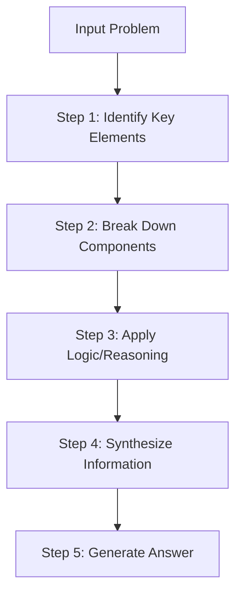
```mermaid
graph TD
    A[Input Problem] --> B[Step 1: Identify Key Elements]
    B --> C[Step 2: Break Down Components]
    C --> D[Step 3: Apply Logic/Reasoning]
    D --> E[Step 4: Synthesize Information]
    E --> F[Step 5: Generate Answer]
```

**Flow Diagram:**
```
Input → [Analyze] → [Decompose] → [Reason] → [Synthesize] → Output
  ↓         ↓           ↓          ↓          ↓
Problem → Elements → Components → Logic → Answer
```

### Chain of Draft (CoD)

**Best for:** Notes, summaries, task files, status updates, and any output where token efficiency matters.

Iterative summarization that produces information-dense output by stripping fluff and keeping only key entities. Every sentence carries weight. Use when verbosity is the enemy and every token counts.

#### Visual Representation

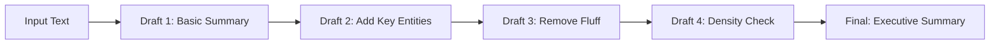
```mermaid
graph LR
    A[Input Text] --> B[Draft 1: Basic Summary]
    B --> C[Draft 2: Add Key Entities]
    C --> D[Draft 3: Remove Fluff]
    D --> E[Draft 4: Density Check]
    E --> F[Final: Executive Summary]
```

**Compression Flow:**
```
Original → [Extract] → [Densify] → [Refine] → [Validate] → Executive Summary
  100%       ↓           ↓          ↓          ↓
           Key Info → Entities → Remove → Density → 20% Size
```

### Cache-Augmented Reasoning + ReAct

**Best for:** Interactive tasks requiring tool use, API calls, code execution, or environment interaction.

Combines reasoning with acting. Think through decisions while interacting with external tools and APIs. Use when the task requires fetching data, running commands, or probing an environment mid-reasoning.

#### Visual Representation

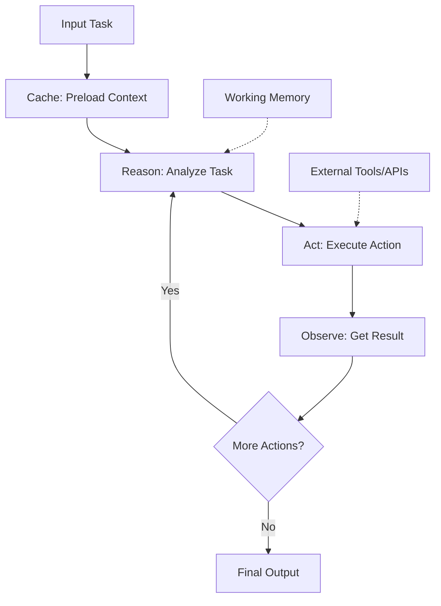
```mermaid
graph TD
    A[Input Task] --> B[Cache: Preload Context]
    B --> C[Reason: Analyze Task]
    C --> D[Act: Execute Action]
    D --> E[Observe: Get Result]
    E --> F{More Actions?}
    F -->|Yes| C
    F -->|No| G[Final Output]

    H[Working Memory] -.-> C
    I[External Tools/APIs] -.-> D
```

**ReAct Cycle:**
```
Input → [Cache] → [Reason] → [Act] → [Observe] → [Decide] → Output
  ↓        ↓         ↓        ↓        ↓         ↓
Task → Context → Analysis → Action → Result → Continue?
```

**Memory Architecture:**
```
┌─────────────────┐    ┌─────────────────┐
│   Short-term    │    │   Long-term     │
│   Memory        │    │   Memory        │
│   (Session)     │    │   (Preferences) │
└─────────────────┘    └─────────────────┘
         │                       │
         └─────── Working Memory ────────┘
```

### Self-Consistency

**Best for:** High-stakes reasoning where accuracy matters more than speed or cost.

Generate multiple independent reasoning paths for the same problem, then majority-vote the answer. Trade compute for accuracy. Use when a wrong answer is expensive and you can afford 3-5 inference passes.

#### Visual Representation

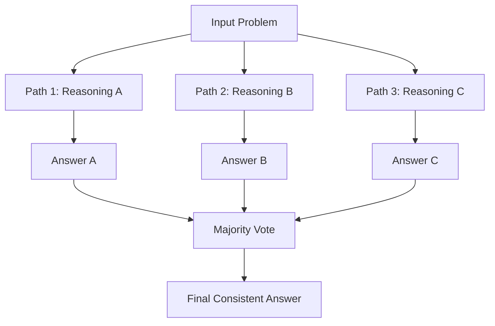
```mermaid
graph TD
    A[Input Problem] --> B[Path 1: Reasoning A]
    A --> C[Path 2: Reasoning B]
    A --> D[Path 3: Reasoning C]
    
    B --> E[Answer A]
    C --> F[Answer B]
    D --> G[Answer C]
    
    E --> H[Majority Vote]
    F --> H
    G --> H
    
    H --> I[Final Consistent Answer]
```

**Parallel Processing:**
```
Input Problem
     ├── Path 1 → Answer A
     ├── Path 2 → Answer B
     └── Path 3 → Answer C
           ↓
    [Majority Vote] → Final Answer
```

**Consistency Matrix:**
```
Path 1: A → B → C → Answer X
Path 2: A → D → E → Answer X  ← Most Common
Path 3: A → F → G → Answer Y
        ↓
    Answer X (2/3 votes)
```

### PAL (Program-Aided Language)

**Best for:** Math, data processing, algorithms, and deterministic computations better solved by code than natural language.

Generate and execute code to solve computational sub-problems. Offload math to the interpreter. Use when exact calculation beats verbal reasoning — let Python do the arithmetic.

#### Visual Representation

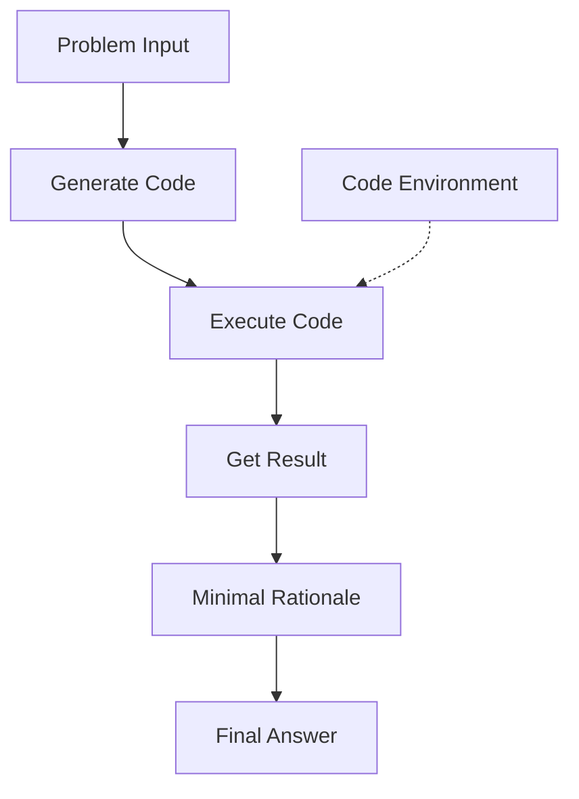
```mermaid
graph TD
    A[Problem Input] --> B[Generate Code]
    B --> C[Execute Code]
    C --> D[Get Result]
    D --> E[Minimal Rationale]
    E --> F[Final Answer]
    
    G[Code Environment] -.-> C
```

**PAL Workflow:**
```
Problem → [Code Gen] → [Execute] → [Result] → [Rationale] → Answer
   ↓         ↓          ↓         ↓         ↓
Math → Function → Run → Value → "# PoT offload" → Final
```

**Code Example:**
```python
# PoT offload
def solve_problem():
    x = 5
    y = 10
    result = x * y + 3
    return result

answer = solve_problem()  # Result: 53
```

### Reflexion

**Best for:** Code generation, design tasks, and creative work where iterative refinement improves quality.

Self-improvement loop: generate, evaluate, reflect, refine, repeat. Three components — actor, evaluator, self-reflection. Use when first drafts are rarely correct and iterative feedback drives convergence. 4.8x accuracy improvement over baselines on code tasks.

#### Visual Representation

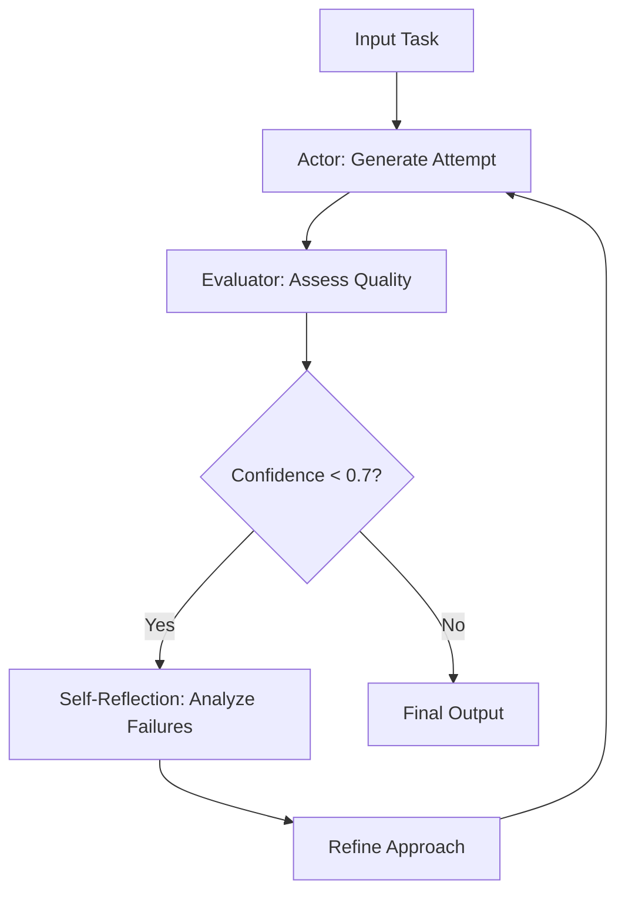
```mermaid
graph TD
    A[Input Task] --> B[Actor: Generate Attempt]
    B --> C[Evaluator: Assess Quality]
    C --> D{Confidence < 0.7?}
    D -->|Yes| E[Self-Reflection: Analyze Failures]
    D -->|No| F[Final Output]
    E --> G[Refine Approach]
    G --> B
```

**Reflexion Loop:**
```
Input → [Actor] → [Evaluator] → [Reflect] → [Refine] → [Actor] → Output
  ↓        ↓         ↓          ↓         ↓        ↓
Task → Generate → Assess → Analyze → Improve → Generate → Result
```

**Three Components:**
```
┌─────────────┐    ┌─────────────┐    ┌─────────────┐
│   Actor     │    │  Evaluator  │    │ Reflection  │
│ (Generate)  │───▶│ (Assess)    │───▶│ (Analyze)   │
└─────────────┘    └─────────────┘    └─────────────┘
       ▲                                        │
       └──────────────── Refine ────────────────┘
```

**Performance Improvement:**
```
Baseline: 19% accuracy
Reflexion: 91% accuracy (4.8x improvement)
```

#### Visual Representation

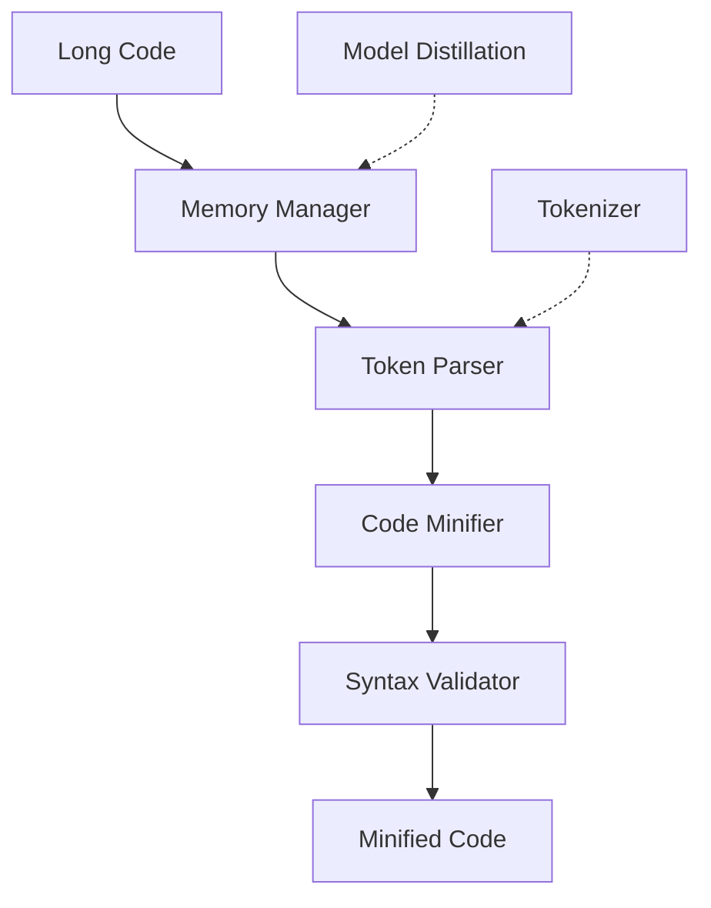
```mermaid
graph TD
    A[Long Code] --> B[Memory Manager]
    B --> C[Token Parser]
    C --> D[Code Minifier]
    D --> E[Syntax Validator]
    E --> F[Minified Code]
    
    G[Model Distillation] -.-> B
    H[Tokenizer] -.-> C
```

**Compression Pipeline:**
```
Original → [Memory] → [Parse] → [Minify] → [Validate] → Minified
  100%       ↓         ↓         ↓         ↓
          Manager → 50% → 20% → Syntax → 5% Size
```

### ToT-lite (Tree of Thoughts)

**Best for:** Strategic planning, puzzles, creative brainstorming, and problems with branching decision points.

Reframe reasoning as tree search. At each step, propose multiple candidate paths, evaluate, prune, and pursue the best branch. Enables lookahead and backtracking. Use when the solution space branches and dead-ends are likely. Bounded to 3 depth x 3 breadth.

#### Visual Representation

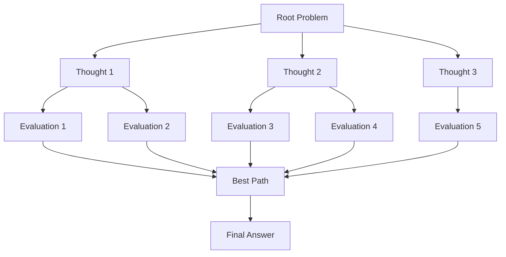
```mermaid
graph TD
    A[Root Problem] --> B[Thought 1]
    A --> C[Thought 2]
    A --> D[Thought 3]
    
    B --> E[Evaluation 1]
    B --> F[Evaluation 2]
    C --> G[Evaluation 3]
    C --> H[Evaluation 4]
    D --> I[Evaluation 5]
    
    E --> J[Best Path]
    F --> J
    G --> J
    H --> J
    I --> J
    
    J --> K[Final Answer]
```

**Tree Structure:**
```
        Problem
       /   |   \
   Thought1 Thought2 Thought3
     / \     / \     |
  Eval1 Eval2 Eval3 Eval4 Eval5
     \   \   /   /   /
      \   \ /   /   /
       \   \   /   /
        Best Path
           |
       Final Answer
```

**Search Process:**
```
Level 1: [Problem] → [Thought A, Thought B, Thought C]
Level 2: [Evaluate] → [Score A, Score B, Score C]
Level 3: [Select] → [Best Path] → [Answer]
```

**Bounded Exploration:**
```
Max Depth: 3 levels
Max Breadth: 3 thoughts per level
Total Paths: 3³ = 27 (bounded)
```

### Metacognitive Prompting (MP)

**Best for:** Complex multi-step tasks where monitoring your own reasoning quality matters.

Decouple reasoning into object-level (solving) and meta-level (monitoring). Includes explicit confidence checks with thresholds (>0.8 direct, 0.6-0.8 cautious, <0.6 reflect). Use when you need to know when you're uncertain and self-correct mid-reasoning.

#### Visual Representation

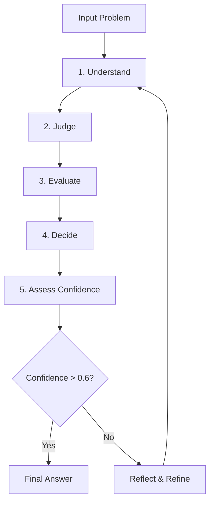
```mermaid
graph TD
    A[Input Problem] --> B[1. Understand]
    B --> C[2. Judge]
    C --> D[3. Evaluate]
    D --> E[4. Decide]
    E --> F[5. Assess Confidence]
    F --> G{Confidence > 0.6?}
    G -->|Yes| H[Final Answer]
    G -->|No| I[Reflect & Refine]
    I --> B
```

**5-Stage Process:**
```
Input → [Understand] → [Judge] → [Evaluate] → [Decide] → [Assess] → Output
  ↓         ↓          ↓         ↓         ↓         ↓
Problem → Goal → Decompose → Filter → Abstract → Pattern → Answer
```

**Meta-Level Architecture:**
```
┌─────────────────┐    ┌─────────────────┐
│   Object Level  │    │   Meta Level    │
│ (Problem Space) │◄──►│ (Control Space) │
│                 │    │                 │
│ • Understand    │    │ • Monitor       │
│ • Judge         │    │ • Control       │
│ • Evaluate      │    │ • Reflect       │
│ • Decide        │    │ • Adjust        │
│ • Assess        │    │                 │
└─────────────────┘    └─────────────────┘
```

**Confidence Assessment:**
```
High Confidence (>0.8): Direct Answer
Medium Confidence (0.6-0.8): Proceed with Caution
Low Confidence (<0.6): Reflect & Refine
```

### Automated Prompt Optimization (APO)

**Best for:** Meta-tasks where you're writing or optimizing prompts for downstream use.

Self-improvement via prompt evolution. Generate variations, test, score, select the best, iterate. Use when the task IS prompt engineering — you're crafting instructions for another agent or refining system prompts.

#### Visual Representation

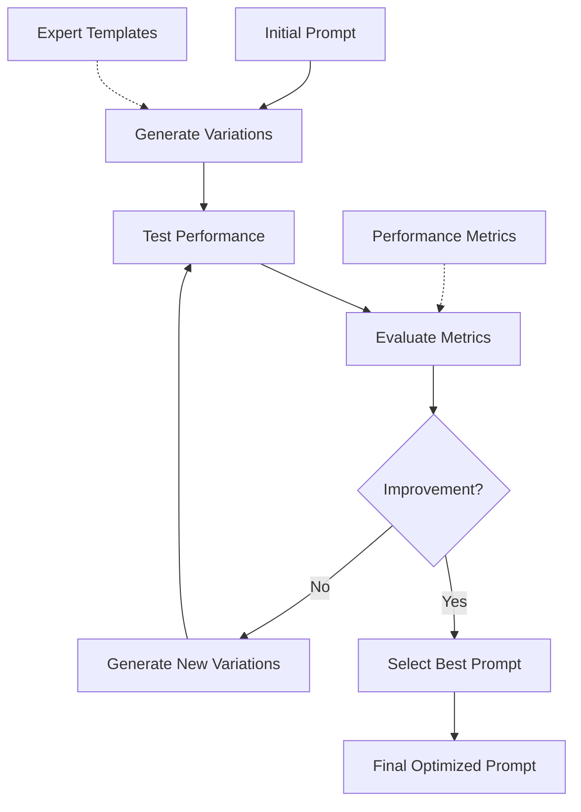
```mermaid
graph TD
    A[Initial Prompt] --> B[Generate Variations]
    B --> C[Test Performance]
    C --> D[Evaluate Metrics]
    D --> E{Improvement?}
    E -->|Yes| F[Select Best Prompt]
    E -->|No| G[Generate New Variations]
    F --> H[Final Optimized Prompt]
    G --> C
    
    I[Performance Metrics] -.-> D
    J[Expert Templates] -.-> B
```

**APO Loop:**
```
Initial → [Generate] → [Test] → [Evaluate] → [Select] → Optimized
  ↓         ↓         ↓         ↓         ↓
Prompt → Variations → Metrics → Best → Refined
```

**Optimization Process:**
```
Generation: Prompt A, Prompt B, Prompt C
Testing:    Score A, Score B, Score C
Selection:  Best Score → New Base
Refinement: Generate A1, A2, A3...
```

**Performance Tracking:**
```
Iteration 1: 70% accuracy
Iteration 2: 75% accuracy (+5%)
Iteration 3: 80% accuracy (+5%)
Iteration 4: 82% accuracy (+2%)
Convergence: 82% (optimal)
```

### Reflexive Analysis

**Best for:** Code generation, refactoring, security-sensitive work, and tasks touching shared infrastructure.

Embed quality, compliance, and architectural checks directly into reasoning. Validate against codebase standards, design patterns, and risk matrices (high/medium/low). Use when correctness, maintainability, and adherence to system conventions are non-negotiable.

#### Visual Representation

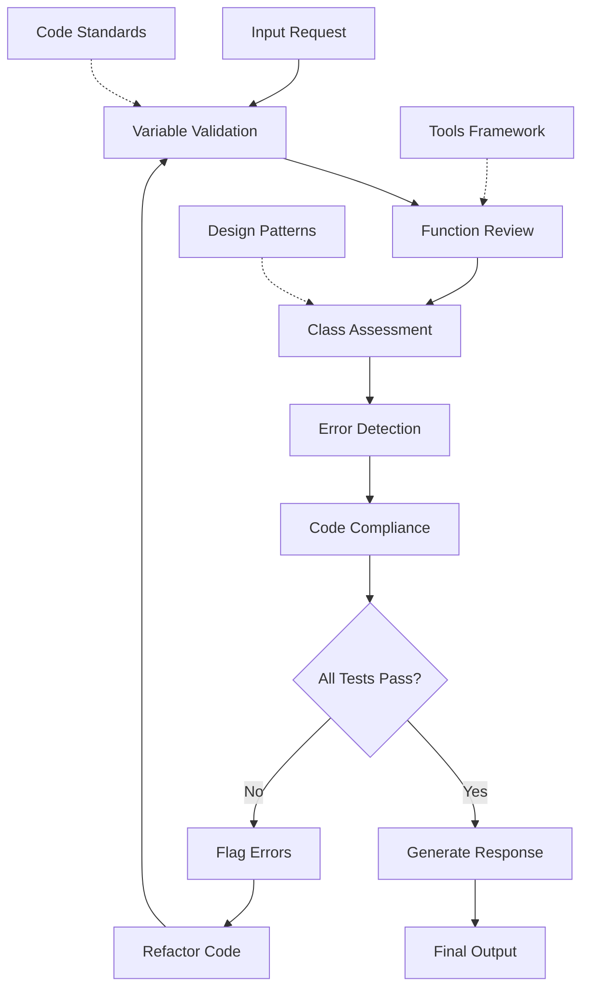
```mermaid
graph TD
    A[Input Request] --> B[Variable Validation]
    B --> C[Function Review]
    C --> D[Class Assessment]
    D --> E[Error Detection]
    E --> F[Code Compliance]
    F --> G{All Tests Pass?}
    G -->|Yes| H[Generate Response]
    G -->|No| I[Flag Errors]
    I --> J[Refactor Code]
    J --> B
    H --> K[Final Output]
    
    L[Code Standards] -.-> B
    M[Tools Framework] -.-> C
    N[Design Patterns] -.-> D
```

**Responsible Code Pipeline:**
```
Input → [Validate] → [Review] → [Assess] → [Detect] → [Comply] → Output
  ↓        ↓         ↓         ↓         ↓         ↓
Request → Variables → Functions → Classes → Errors → Approved → Response
```

**Multi-Dimensional Analysis:**
```
┌─────────────┐  ┌─────────────┐  ┌─────────────┐
│  Variables  │  │  Functions  │  │   Classes   │
│ Validation  │  │   Review    │  │ Assessment  │
└─────────────┘  └─────────────┘  └─────────────┘
       │                │                │
       └─────────── Error Detection ──────┘
                        │
                   [Approval Gate]
```

**Risk Assessment Matrix:**
```
High Risk:   System, Database, Security operations
Medium Risk: Business logic, Data processing
Low Risk:    Utilities, Helper functions
```

### Progressive-Hint Prompting (PHP)

**Best for:** Multi-turn conversations, tutoring, debugging sessions, and tasks that benefit from building on prior answers.

Use previous answers as hints to progressively refine toward the correct solution. Cumulative context builds across turns. Use when the task naturally unfolds over multiple interactions and each answer informs the next.

#### Visual Representation

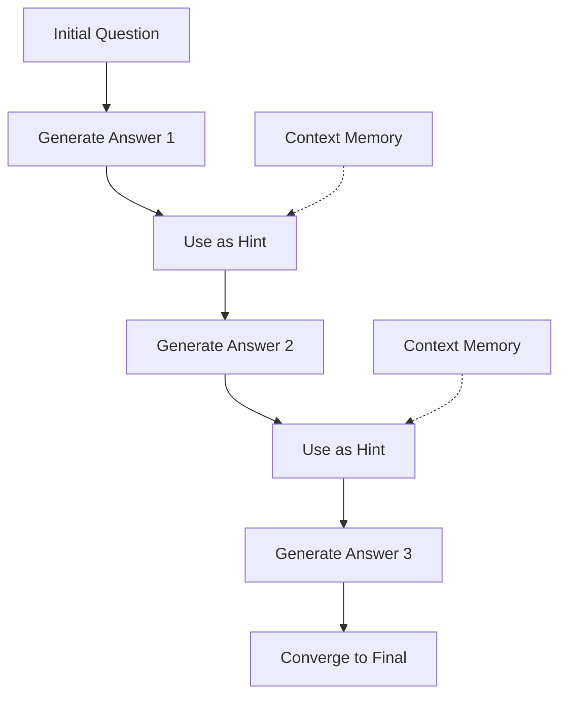
```mermaid
graph TD
    A[Initial Question] --> B[Generate Answer 1]
    B --> C[Use as Hint]
    C --> D[Generate Answer 2]
    D --> E[Use as Hint]
    E --> F[Generate Answer 3]
    F --> G[Converge to Final]
    
    H[Context Memory] -.-> C
    I[Context Memory] -.-> E
```

**Progressive Learning:**
```
Turn 1: Question → Answer A → [Store as Hint]
Turn 2: Question + Hint A → Answer B → [Store as Hint]
Turn 3: Question + Hint A + Hint B → Answer C → [Final]
```

**Cumulative Context:**
```
┌─────────────┐    ┌─────────────┐    ┌─────────────┐
│   Turn 1    │    │   Turn 2    │    │   Turn 3    │
│             │    │             │    │             │
│ Q → A1      │───▶│ Q + A1 → A2 │───▶│ Q + A1 + A2 │
│             │    │             │    │     → A3    │
└─────────────┘    └─────────────┘    └─────────────┘
```

**Hint Accumulation:**
```
Context Size: 1 → 2 → 3 → ... → N
Accuracy:    60% → 75% → 85% → ... → 95%
```

**Multi-Turn Flow:**
```
User: "How to create a function?"
AI:  "def function_name(): return value"
User: "How to add parameters?"
AI:  "def function_name(param1, param2): return param1 + param2"
User: "How to add type hints?"
AI:  "def function_name(param1: int, param2: int) -> int: return param1 + param2"
```

### Cache-Augmented Generation (CAG)

**Best for:** Tasks where relevant context is known upfront and real-time retrieval would add latency.

Preload all relevant context into working memory before reasoning. Eliminates retrieval dependencies mid-task. Use when you have the full context available and want low-latency, self-contained reasoning.

#### Visual Representation

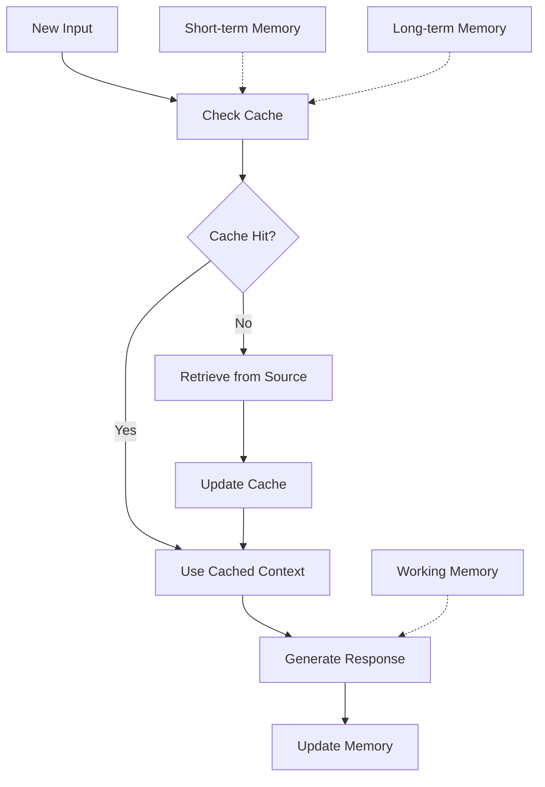
```mermaid
graph TD
    A[New Input] --> B[Check Cache]
    B --> C{Cache Hit?}
    C -->|Yes| D[Use Cached Context]
    C -->|No| E[Retrieve from Source]
    E --> F[Update Cache]
    F --> D
    D --> G[Generate Response]
    G --> H[Update Memory]
    
    I[Short-term Memory] -.-> B
    J[Long-term Memory] -.-> B
    K[Working Memory] -.-> G
```

**Memory Hierarchy:**
```
┌─────────────────┐    ┌─────────────────┐    ┌─────────────────┐
│   Short-term    │    │   Long-term     │    │   Working       │
│   Memory        │    │   Memory        │    │   Memory        │
│   (Session)     │    │   (Preferences) │    │   (Active)      │
│                 │    │                 │    │                 │
│ • Current       │    │ • User Profile  │    │ • Current Task  │
│ • Recent        │    │ • History       │    │ • Context       │
│ • Temporary     │    │ • Patterns      │    │ • State         │
└─────────────────┘    └─────────────────┘    └─────────────────┘
```

**Cache Performance:**
```
Cache Hit:  ~10ms response time
Cache Miss: ~500ms response time
Hit Rate:   85% (typical)
```

**Memory Management:**
```
Input → [Check] → [Hit/Miss] → [Retrieve] → [Generate] → [Update]
  ↓        ↓         ↓           ↓           ↓          ↓
Query → Cache → Context → Response → Memory → Store
```

### Cognitive Scaffolding Prompting

**Best for:** Learning tasks, onboarding, skill-building, and problems where building mental models matters more than a quick answer.

Build mental models through progressive scaffolding: expert guidance → peer collaboration → independent reasoning → internalized models. Use when the goal is understanding, not just output — teach to fish rather than handing one over.

#### Visual Representation

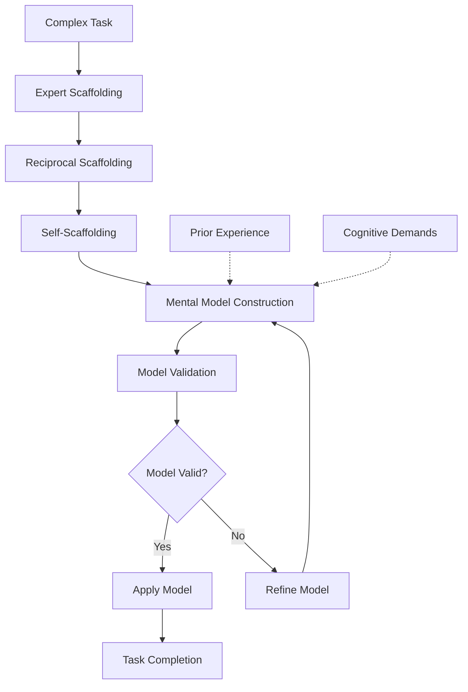
```mermaid
graph TD
    A[Complex Task] --> B[Expert Scaffolding]
    B --> C[Reciprocal Scaffolding]
    C --> D[Self-Scaffolding]
    D --> E[Mental Model Construction]
    E --> F[Model Validation]
    F --> G{Model Valid?}
    G -->|Yes| H[Apply Model]
    G -->|No| I[Refine Model]
    I --> E
    H --> J[Task Completion]
    
    K[Prior Experience] -.-> E
    L[Cognitive Demands] -.-> E
```

**Scaffolding Levels:**
```
Level 1: Expert Scaffolding (Teacher/Guide)
Level 2: Reciprocal Scaffolding (Peer/Group)
Level 3: Self-Scaffolding (Independent)
Level 4: Mental Model (Internalized)
```

**Mental Model Construction:**
```
┌─────────────┐    ┌─────────────┐    ┌─────────────┐
│   Prior     │    │  Cognitive  │    │   Mental    │
│ Experience  │───▶│   Demands   │───▶│   Model     │
│             │    │             │    │             │
│ • Knowledge │    │ • Task      │    │ • Structure │
│ • Skills    │    │ • Context   │    │ • Process   │
│ • Patterns  │    │ • Goals     │    │ • Rules     │
└─────────────┘    └─────────────┘    └─────────────┘
```

**Scaffolding Agency:**
```
Expert:     Direct instruction, modeling
Reciprocal: Collaborative problem-solving
Self:       Independent reasoning, reflection
```

**Validation Process:**
```
Model → [Test] → [Validate] → [Refine] → [Apply]
  ↓        ↓         ↓          ↓         ↓
Build → Check → Verify → Improve → Use
```

### Advanced Techniques

### Internal Knowledge Synthesis (IKS)

**Best for:** Tasks spanning multiple knowledge domains where internal consistency across domains must be validated.

Generate hypothetical knowledge constructs from parametric memory, cross-reference for consistency, resolve conflicts, and synthesize. Use when the task touches multiple domains and you need to validate that claims don't contradict across knowledge areas.

#### Visual Representation

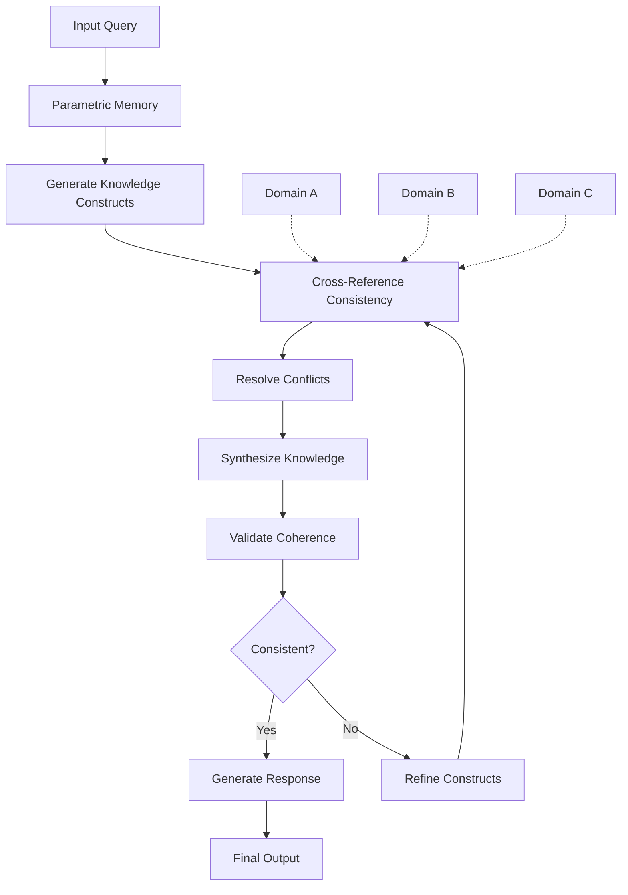
```mermaid
graph TD
    A[Input Query] --> B[Parametric Memory]
    B --> C[Generate Knowledge Constructs]
    C --> D[Cross-Reference Consistency]
    D --> E[Resolve Conflicts]
    E --> F[Synthesize Knowledge]
    F --> G[Validate Coherence]
    G --> H{Consistent?}
    H -->|Yes| I[Generate Response]
    H -->|No| J[Refine Constructs]
    J --> D
    I --> K[Final Output]
    
    L[Domain A] -.-> D
    M[Domain B] -.-> D
    N[Domain C] -.-> D
```

**Knowledge Integration:**
```
Parametric Memory → [Generate] → [Cross-Reference] → [Synthesize] → Response
       ↓              ↓              ↓               ↓
   Training Data → Constructs → Consistency → Integration → Output
```

**Multi-Domain Synthesis:**
```
┌─────────────┐  ┌─────────────┐  ┌─────────────┐
│   Domain A  │  │   Domain B  │  │   Domain C  │
│  (Science)  │  │ (History)   │  │ (Culture)   │
└─────────────┘  └─────────────┘  └─────────────┘
       │                │                │
       └─────── Cross-Reference ─────────┘
                        │
                   [Consistency Check]
                        │
                   [Synthesized Knowledge]
```

**Conflict Resolution:**
```
Parametric: "X is true"
Context:    "X is false"
Resolution: "X is conditionally true based on Y"
```

**Consistency Validation:**
```
Level 1: Sentence-level coherence
Level 2: Domain-level consistency
Level 3: Cross-domain integration
Level 4: Global coherence
```

### Multimodal Synthesis

**Best for:** Tasks involving images, charts, diagrams, screenshots, or any visual+textual input.

Fuse text and visual inputs through a cross-modal reasoning layer. Interpret charts, analyze screenshots, answer visual questions. Use when the input includes images or visual artifacts that text-only reasoning would miss.

#### Visual Representation

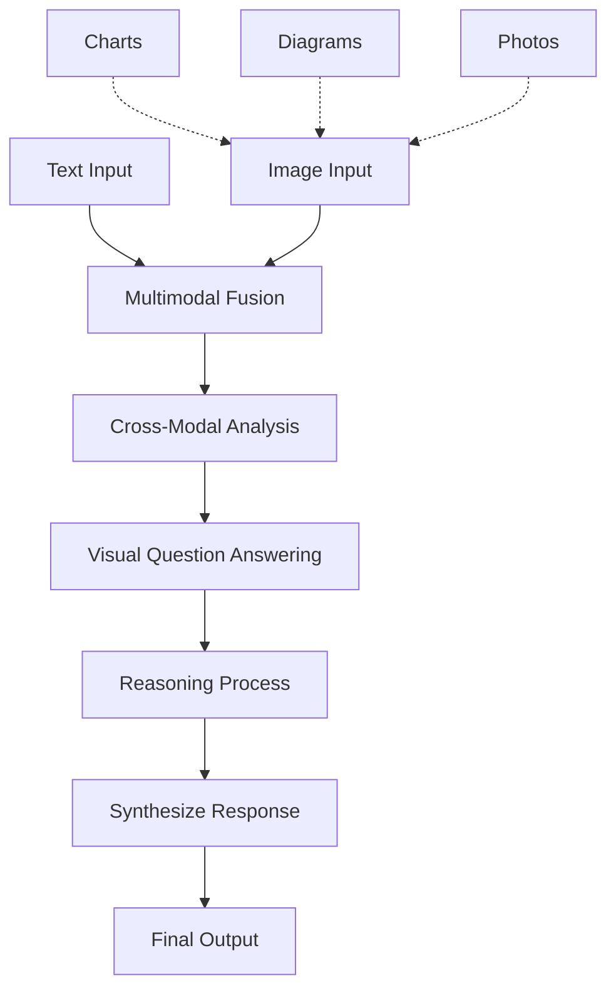
```mermaid
graph TD
    A[Text Input] --> C[Multimodal Fusion]
    B[Image Input] --> C
    C --> D[Cross-Modal Analysis]
    D --> E[Visual Question Answering]
    E --> F[Reasoning Process]
    F --> G[Synthesize Response]
    G --> H[Final Output]
    
    I[Charts] -.-> B
    J[Diagrams] -.-> B
    K[Photos] -.-> B
```

**Multimodal Processing:**
```
Text + Image → [Fusion] → [Analysis] → [Reasoning] → [Synthesis] → Output
  ↓      ↓        ↓         ↓          ↓           ↓
Query + Visual → Combine → Cross-Modal → CoT → Integrate → Answer
```

**Cross-Modal Analysis:**
```
┌─────────────┐    ┌─────────────┐    ┌─────────────┐
│    Text     │    │   Visual    │    │   Audio     │
│ Processing  │    │ Processing  │    │ Processing  │
└─────────────┘    └─────────────┘    └─────────────┘
       │                  │                  │
       └─────────── Fusion Layer ────────────┘
                        │
                   [Cross-Modal Reasoning]
```

**Visual Question Answering:**
```
Question: "What is shown in this chart?"
Image:    [Bar chart showing sales data]
Process:  Text + Visual → Analysis → Reasoning → Answer
Result:   "The chart shows Q3 sales increased by 15%"
```

**Modality Integration:**
```
Text:     "Analyze this data"
Image:    [Data visualization]
Audio:    [Spoken context]
Output:   "Based on the visual data and audio context..."
```

### Knowledge Synthesis Prompting (KSP)

**Best for:** Cross-disciplinary synthesis, research tasks, and complex factual writing spanning multiple fields.

Integrate knowledge across domains with fine-grained coherence validation. Extract, validate, resolve conflicts, synthesize. Use when the task requires weaving together facts from unrelated fields into a single coherent output.

#### Visual Representation

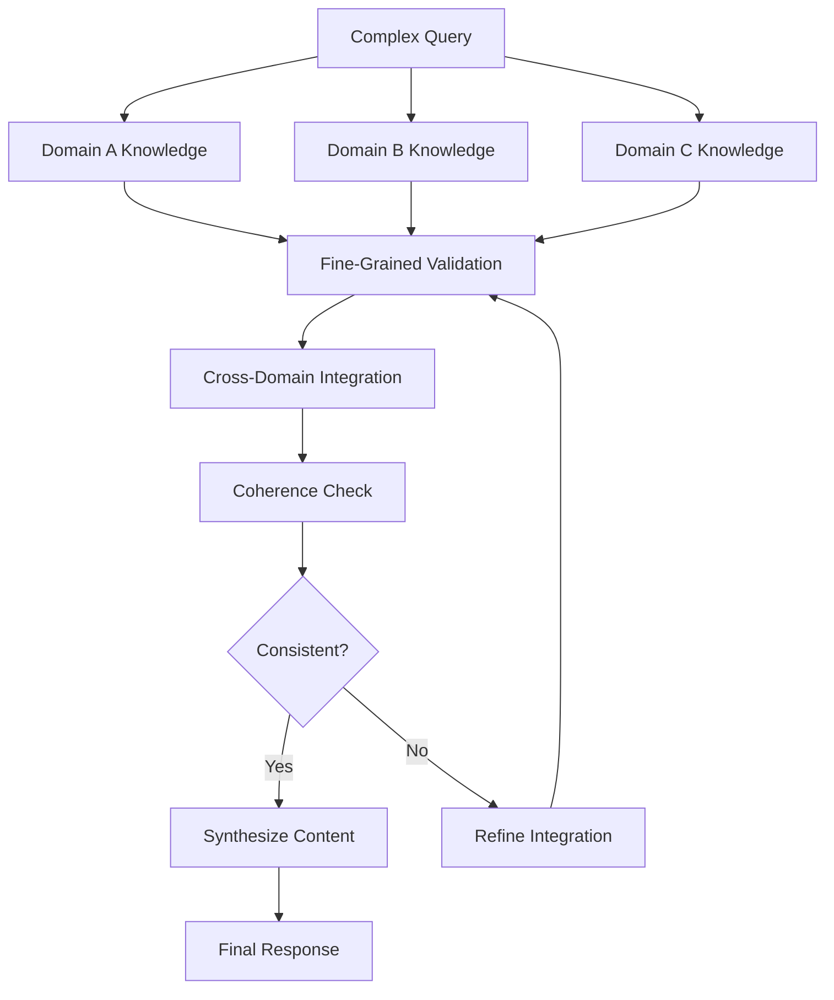
```mermaid
graph TD
    A[Complex Query] --> B[Domain A Knowledge]
    A --> C[Domain B Knowledge]
    A --> D[Domain C Knowledge]
    
    B --> E[Fine-Grained Validation]
    C --> E
    D --> E
    
    E --> F[Cross-Domain Integration]
    F --> G[Coherence Check]
    G --> H{Consistent?}
    H -->|Yes| I[Synthesize Content]
    H -->|No| J[Refine Integration]
    J --> E
    I --> K[Final Response]
```

**Cross-Domain Integration:**
```
Domain A + Domain B + Domain C → [Validate] → [Integrate] → [Synthesize] → Output
    ↓           ↓           ↓         ↓          ↓           ↓
  Science + History + Culture → Coherence → Combine → Factual → Answer
```

**Knowledge Validation:**
```
┌─────────────┐  ┌─────────────┐  ┌─────────────┐
│   Domain A  │  │   Domain B  │  │   Domain C  │
│  (Science)  │  │ (History)   │  │ (Culture)   │
└─────────────┘  └─────────────┘  └─────────────┘
       │                │                │
       └─────────── Fine-Grained ────────┘
                   Validation
                        │
                   [Coherence Check]
                        │
                   [Synthesized Knowledge]
```

**Integration Process:**
```
Step 1: Extract knowledge from each domain
Step 2: Validate consistency across domains
Step 3: Identify conflicts and resolve
Step 4: Integrate coherently
Step 5: Synthesize final content
```

**Coherence Levels:**
```
Level 1: Sentence-level coherence
Level 2: Domain-level consistency
Level 3: Cross-domain integration
Level 4: Global factual accuracy
```

#### Visual Representation

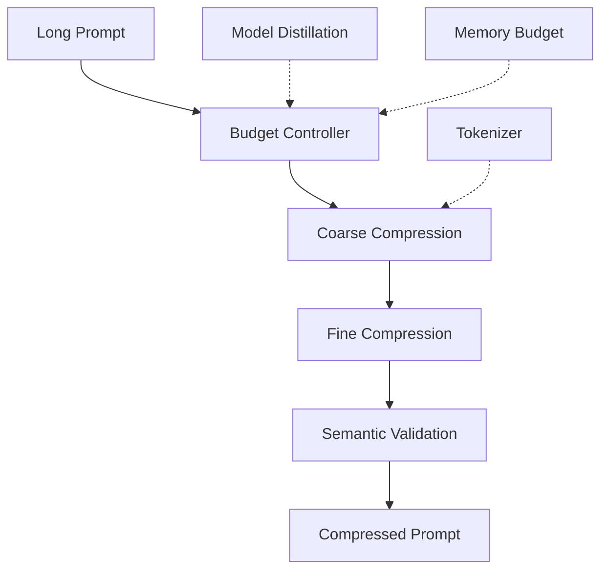
```mermaid
graph TD
    A[Long Prompt] --> B[Budget Controller]
    B --> C[Coarse Compression]
    C --> D[Fine Compression]
    D --> E[Semantic Validation]
    E --> F[Compressed Prompt]
    
    G[Model Distillation] -.-> B
    H[Tokenizer] -.-> C
    I[Memory Budget] -.-> B
```

**Compression Pipeline:**
```
Original → [Budget] → [Coarse] → [Fine] → [Validate] → Compressed
  100%       ↓         ↓         ↓         ↓
          Control → 50% → 20% → Semantic → 5% Size
```

**Performance Metrics:**
```
Compression: 20x
Performance Loss: <5%
Latency Reduction: 80%
Cost Reduction: 95%
```

**Memory Budget Management:**
```
Input: 10,000 tokens
Budget: 500 tokens (5%)
Strategy: Keep essential, remove redundant
Output: 500 tokens (20x compression)
```

### Compression Strategies

When context is tight, apply these in order:
1. Preserve reasoning chains, compact or drop examples
2. Use structured formats (XML, JSON) over prose
3. Apply progressive detail reduction — most relevant first, trim by salience

### Consistency Checks

Before finalizing any output:
1. Verify logical coherence — no contradictions in the reasoning chain
2. Validate internal knowledge consistency — facts must agree across domains

### Confidence Calibration

Explicitly quantify uncertainty on a 0.0–1.0 scale:
- 0.0–0.3: Guessing — flag as unreliable
- 0.3–0.6: Uncertain — state assumptions
- 0.6–0.8: Confident — proceed with caution
- 0.8–1.0: Certain — proceed

### Acronyms REFERENCE

### Core Frameworks

- OOReDAct = Observe-Orient-Reason-Decide-Act
- CUC-N = Complexity, Uncertainty, Consequence, Novelty
- CAG = Cache-Augmented Generation
- IKS = Internal Knowledge Synthesis
- RAG = Retrieval-Augmented Generation
- APO = Automated Prompt Optimization
- MP = Metacognitive Prompting

### Reasoning Methods

- CoD = Chain-of-Draft
- CoT = Chain-of-Thought
- SCoT = Structured Chain-of-Thought  
- ToT = Tree-of-Thoughts
- PAL = Program-Aided Language Models
- ReAct = Reasoning and Acting
- KSP = Knowledge Synthesis Prompting
- PoT = Program-of-Thought
- SC = Self-Consistency
- PHP = Progressive-Hint Prompting
- CSP = Cognitive Scaffolding Prompting

---

## Execution Rules

- Analyze each technique in ≤5 words when scanning for suitability
- If no strategy is explicitly selected, default to CoT + ReAct
- Always include the selected strategy name and its suitability rating in the `<reason>` tag
- Re-rate strategies if the task scope shifts mid-execution
