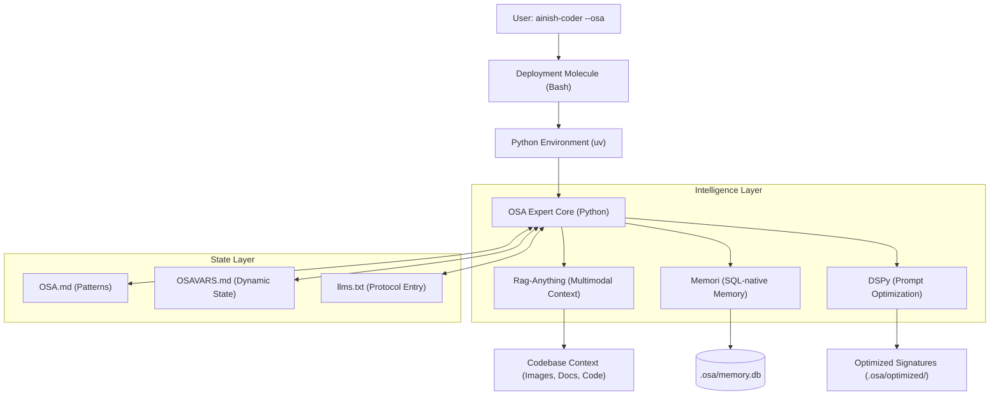

# Agent One Plan: OSA 4.0 SOTA Integration

## Summary of Progress
- **Research Phase**: Deeply researched the integration of `Rag-Anything`, `Memori`, and `DSPy`.
- **Component Selection**:
    - **Rag-Anything**: Selected for multimodal RAG (indexing PDFs, images, and code).
    - **Memori**: Selected for SQL-native long-term memory to persist agent experiences and preferences.
    - **DSPy**: Selected for self-optimizing prompt signatures and reasoning logic.
- **Protocol Design**: Developed the "Point & Shoot" experience via `@llms.txt` to allow any agent to bootstrap the expert system.
- **Deployment Strategy**: Integrated the expert core into the `ainish-coder --osa` bash deployment pipeline using `uv`.

## The Plan: OSA 4.0 SOTA Expert Agent System (Self-Improving)

### User Flow: The "@llms.txt" Experience
1. **Deployment**: User runs `ainish-coder --osa`. This pulls all required framework files (`OSA.md`, `llms.txt`, etc.) and the `osa_expert/` core.
2. **Point & Shoot**: The user points their AI coding agent (Cursor, Claude Code, etc.) to `@llms.txt` with a request.
3. **Bootstrap**: The agent reads the `[SETUP]` section in `llms.txt`, which instructs it to:
    - `source .osa/bin/activate`
    - `python -m osa_expert bootstrap` (Indexes the codebase with Rag-Anything).
4. **Autonomous Expertise**: The agent now uses the `osa-expert` tool to:
    - Query **Rag-Anything** for deep codebase context.
    - Consult **Memori** for past user preferences and successful patterns.
    - Use **DSPy** optimized signatures for complex reasoning tasks.

### Architecture Overview

### Technical Knowledge & Implementation Propositions

### 1. Context Layer: LightRAG (The Engine of Rag-Anything)
- **Package**: `lightrag-hku`
- **Multimodal Strategy**: 
    - Use the integrated `Rag-Anything` pipeline to parse non-textual assets (UI screenshots, architecture diagrams).
    - Map these assets into the Knowledge Graph (KG) as entities linked to specific code modules.
    - **Outcome**: When an agent asks "Where is the login logic?", the system returns not just `auth.py`, but also any related UI wireframes or security diagrams indexed in the KG.

### 2. Memory Layer: Memori (SQL-Native)
- **Provider**: GibsonAI / MemoriLabs
- **Stack**: SQL-native (SQLite for local, PostgreSQL for cloud).
- **Capability**: Persistent cross-session memory using `user_id` and `session_id`.
- **Proposition**:
    - Store successful "Trunk Promises" (from `OSA.md`) as "Codebase Invariants" or "Learned Patterns".
    - When an agent starts a task, it first retrieves relevant "lessons" from Memori to avoid repeating past mistakes.

### 3. Reasoning Layer: DSPy (Self-Improving)
- **Framework**: `dspy-ai`
- **Pattern**: Compounding Engineering (Cycle: Review → Triage → Plan → Learn).
- **Proposition**:
    - Define `osa_expert.ExpertSignature(dspy.Signature)` for high-level architectural decisions.
    - Use `dspy.Retrieve` backed by the `LightRAG` index.
    - **Self-Improvement**: After a successful `git commit` that resolves a `TODO.md` item, the system triggers a `DSPy` optimization run (`BootstrapFewShot`) using the latest `Memori` logs as training examples.

---

### Proposed CLI Structure (`osa-expert`)
The Python core will expose a CLI for the orchestrator (Ralph) and other agents to interact with:

| Command | Description |
|---------|-------------|
| `python -m osa_expert bootstrap` | Initializes `.osa/`, sets up SQLite, and runs the initial LightRAG index. |
| `python -m osa_expert query "{prompt}"` | Performs a hybrid search (KG + Semantic) and returns augmented context. |
| `python -m osa_expert learn --promise "{id}"` | Extracts the "Lesson Learned" from a completed task and stores it in Memori. |
| `python -m osa_expert optimize` | Background task to run DSPy `BootstrapFewShot` on the latest dataset of successful tasks. |

---

## Updated Implementation Roadmap
1. **Expert Core**: Build `osa_expert/` directory with `context.py` (LightRAG), `memory.py` (Memori), and `brain.py` (DSPy).
2. **Framework Update**: Enhance `llms.txt` with the bootstrap protocol and `OSA.md` with the Expert Loop pattern.
3. **Bash Deployment**: Update `deploy_osaa.sh` to handle the `uv` environment and source deployment.
4. **Self-Improvement Loop**: Implement the background optimization cycle using successful `TODO.md` completions.

## Current Status
- [x] Research & Component Selection
- [x] Architecture & Flow Design
- [ ] Implement `osa_expert/` Core
- [ ] Update Framework Files (`llms.txt`, `OSA.md`)
- [ ] Update Deployment Scripts
- [ ] Final Verification
